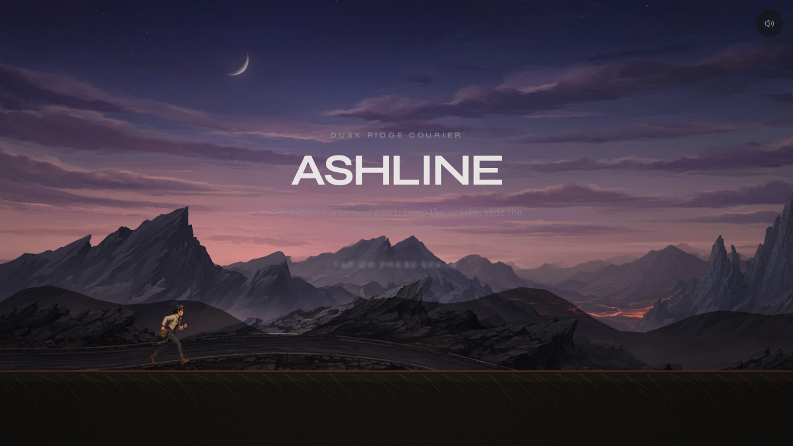
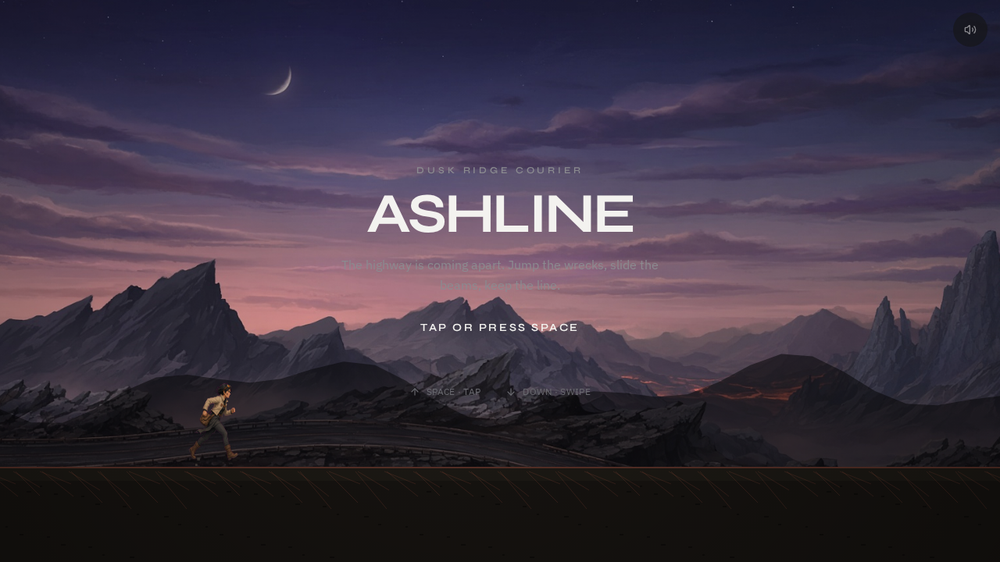
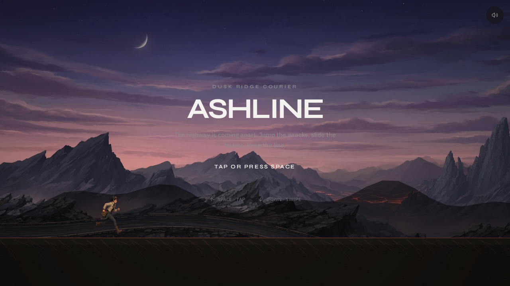
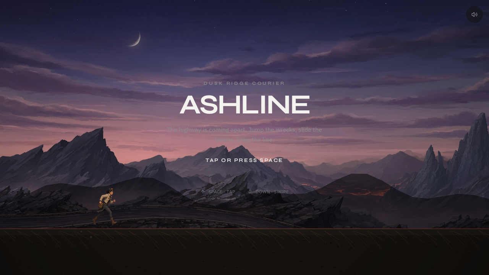

# ASHLINE

**An endless dusk-ridge runner. Jump, slide, and keep the line.**

ASHLINE is a fast-paced, browser-based endless runner set on a crumbling highway ridge at dusk. You are a dusk-ridge courier running the line as the road comes apart around you: leap over wrecked cars and spikes, slide beneath fallen beams, scoop up coins, and brush past obstacles for near-miss bonuses as the ridge slowly breaks you.

## Project Overview

ASHLINE is a single-page arcade game. The whole experience lives on one screen: a full-viewport HTML5 canvas rendered by a hand-written 2D engine, wrapped in a minimal DOM chrome (title, HUD, results, mute toggle) styled with Tailwind. Runs are endless and procedurally generated, so every attempt is a new layout of wrecks, beams, and coin arcs.

## Purpose

ASHLINE is a self-contained demonstration of what a polished game can be with no external game engine or audio assets. It shows how a tight arcade loop — one-button-ish controls, escalating speed, combo-driven scoring — can be built entirely in the browser, and it doubles as a compact reference for "game feel": a fixed-timestep physics simulation, squash-and-stretch animation, hit-stop, screen shake, and feedback-first UI. It is designed to be played in seconds and to make "one more run" hard to resist.

## Design & UI

- **Visual direction** — a moody dusk palette of near-black backgrounds, warm ember accents, and off-white type, over a slow-panning painted sky with parallax ridge silhouettes and a procedurally textured ground.
- **Layout** — a fixed 1280x720 internal world that letterboxes cleanly onto any viewport, with DOM overlays for the title screen, in-run HUD, and the game-over card.
- **Responsive & touch** — keyboard, mouse, gamepad, and touch are all first-class; on phones, on-screen Jump and Slide buttons appear and safe-area insets are respected.
- **Motion & juice** — squash-and-stretch on the runner, dust/ember/spark particle bursts, floating score popups, trauma-based screen shake, hit-stop on impact, an impact-flash sprite, and a vignette. Staggered entrance animations respect `prefers-reduced-motion`.
- **Sound** — every effect is synthesized in-browser with the Web Audio API (jump, land, slide, coin, hit, combo chime, footsteps); no audio files are shipped. A mute toggle is one tap away.

## Key Features

- Endless runs with speed that ramps up the further you travel
- Jump over crates and spikes; slide under overhead beams
- Coin arcs placed along obstacle routes, worth more as your combo grows
- Combo multiplier for chaining cleared obstacles, plus bonus **NEAR** points for close calls
- Game-over summary: score, distance, peak combo, and "new best" detection
- Best score, best combo, best distance, and mute preference persist in `localStorage`
- Procedural obstacle density that scales with distance traveled

## Tech Stack

- React 19 + TypeScript
- TanStack Start / Router
- Tailwind CSS v4 with custom design tokens
- HTML5 Canvas 2D — a hand-rolled rendering engine
- Web Audio API — procedurally synthesized sound effects
- lucide-react icons
- Custom sprite sheets and a painted sky backdrop

## Project Highlights

- **A game engine, not a library** — physics, spawning, collision, and rendering are written from scratch on Canvas 2D, with a fixed-timestep (60 Hz) simulation loop and object pooling for entities and particles.
- **Feel over flash** — jump buffering, coyote time, variable jump height, hit-stop, trauma shake, and screen flash give the controls an arcade-weight responsiveness.
- **Zero-asset sound** — all effects are generated at runtime from oscillators and filtered noise, so the game is fully self-contained.
- **Accessible by default** — reduced-motion handling, keyboard/gamepad/touch parity, and clear on-screen affordances.
- **PWA-ready and shareable** — ships with a web app manifest, a custom social card, and a distinctive ember-line favicon.

## Screenshots / Preview

The repository includes in-game captures under `screenshots/`.

| Title screen | Mid-run |
| --- | --- |
|  |  |

| Jumping a wreck | Sliding under a beam |
| --- | --- |
|  |  |

## AI-Assisted Development

ASHLINE was originally built in the Grok App Builder, an AI-assisted app creation environment, and refined through iterative in-browser QA covering desktop and mobile renders, interaction checks, and a production build verification pass.
